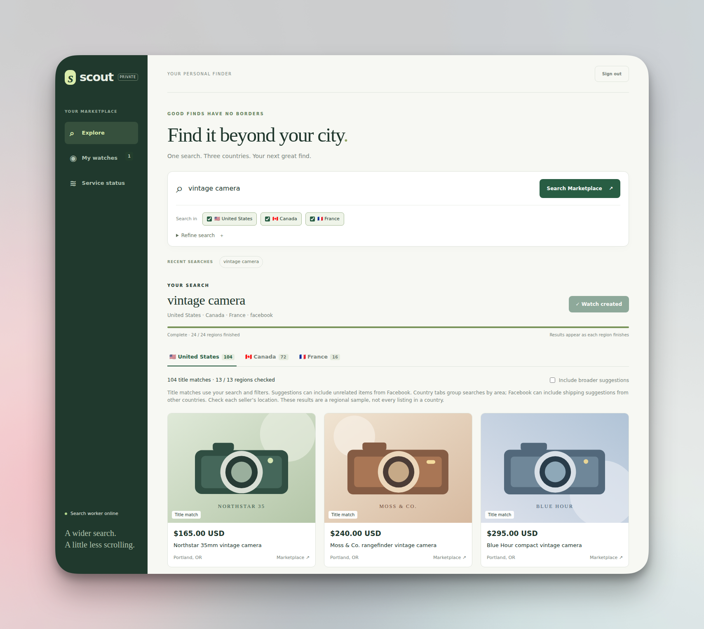

<div align="center">

# Scout — Facebook Marketplace Wide Search & Alerts

**Find the Marketplace listings you care about. Let Scout keep looking.**

A self-hosted dashboard for Facebook Marketplace searches, saved watches and Telegram alerts.

[Get started](#get-started) · [Account & VPN](#choose-your-facebook-account-and-network) · [Server setup](docs/deployment.md) · [Docker + Gluetun](docs/docker.md)

</div>



## What you can do

- **Explore across borders.** Search regional areas in the USA, Canada and mainland France from one place.
- **Find the right version.** Refine titles with required/excluded phrases and set a budget in each currency.
- **Save a watch.** Turn a search into scheduled checks without re-entering your filters.
- **Get Telegram alerts.** Receive newly discovered matches without keeping the dashboard open.
- **Check the photos.** Add optional reference images to help filter visually similar items and review uncertain matches.
- **Keep your setup local.** Your browser session, search history and database live on your own server.

Scout is an early-stage project. Results are regional samples, not an exhaustive country-wide inventory, and Facebook can interrupt access with login checkpoints.

## Get started

You need **Linux**, **Python 3.12+**, [uv](https://docs.astral.sh/uv/) and a Facebook account with Marketplace access. Telegram is optional.

### 1. Install Scout

```bash
git clone https://github.com/MelvinSDRS/Scout.git
cd Scout
uv sync --frozen
```

### 2. Connect Facebook

```bash
uv run scout login --setup
```

Sign in in the browser, complete any verification, then open **Marketplace**. Scout detects the login and saves the session automatically—no cookie copying or Enter confirmation. Setup installs Chromium and may request your sudo password for system dependencies.

**Installing on a server without a screen?** Follow the [remote login guide](docs/deployment.md#headless-facebook-login). **Using Docker + Gluetun?** Use the [container login procedure](docs/docker.md#facebook-login-through-the-vpn) so Facebook stays on the VPN connection.

### 3. Open your dashboard

```bash
uv run scout serve
```

On a local desktop, Scout opens the dashboard and signs you in. To reopen it later, run `uv run scout open`. For a remote server, use the [dashboard launcher](docs/deployment.md#dashboard-access).

No `.env` file is needed for the default local setup. When you want to configure Telegram or other options:

```bash
cp .env.example .env
```

Edit `.env`, then restart Scout to apply your changes.

## Your first watch

1. Open **Explore**, enter an item such as `vintage camera`, and choose your countries.
2. Use **Refine search** to add a budget, exclude phrases such as `parts only`, or narrow down the model.
3. Browse the results, then select **Create watch** to keep checking with those filters.
4. Manage your saved searches and review uncertain photo matches in **My watches**.

Creating a watch from a search treats its existing matches as already seen, so they are not sent as new alerts. Price limits are per currency; Scout does not silently convert USD, CAD or EUR.

## Telegram alerts

Add your bot token and chat ID to `.env`:

```dotenv
TELEGRAM_BOT_TOKEN=your_bot_token
TELEGRAM_CHAT_ID=your_chat_id
# Optional: send into a Telegram forum topic
# TELEGRAM_MESSAGE_THREAD_ID=your_topic_id
```

Restart Scout, then send one test message:

```bash
uv run scout test-notification
```

Use a bot and destination you control. Scout only sends notifications; it does not read your Telegram messages or poll for bot updates. An alert means **newly discovered by that watch**, not necessarily newly posted on Facebook.

## Choose your Facebook account and network

**Prefer a dedicated account you do not rely on for everyday Facebook use**, where permitted by Meta's account rules. Keeping Scout separate avoids changing the Marketplace location you use personally and reduces your reliance on an account used for automation. A disposable or “throwaway” account is not protection against restrictions; it can still face verification or suspension. Meta's [account rules](https://www.facebook.com/help/203498356357867) also restrict maintaining multiple personal accounts.

**A VPN is recommended if you want Scout's traffic to use a separate network exit from your home connection.** The [Docker + Gluetun setup](docs/docker.md) runs both Scout and its Facebook browser through an existing VPN tunnel. Log in through that same container setup.

A VPN **does not prevent Facebook bans** or make automation undetectable. Neither a dedicated account nor a VPN removes account-level restrictions or the need for permission: [Meta states that unauthorized automated collection violates its terms](https://about.fb.com/news/2021/04/how-we-combat-scraping/). Scout does not bypass checkpoints or CAPTCHAs.

### Keep your original Marketplace location

By default, Scout saves your Marketplace **location and radius** before a scan batch and restores them afterward, including after errors or cancellation. While a scan is running, opening Marketplace yourself can still show the region currently being searched.

```dotenv
SCOUT_FACEBOOK_RESTORE_HOME=true
```

If restoration fails, Scout keeps the saved settings, pauses new scans and retries. The dashboard shows the recovery issue. If an earlier scan already changed your location, set your preferred location and radius in Facebook before starting a new batch.

**Using a dedicated account?** You can skip this step entirely:

```dotenv
SCOUT_FACEBOOK_RESTORE_HOME=false
```

Scout then leaves Marketplace at the last searched location and skips location capture, restoration and recovery. For a regular installation, edit `.env` and restart Scout. For Docker, edit `.env.docker` and run `docker compose up -d scout` to recreate it with the new setting. Keep restoration enabled if you use the same account manually.

## Run it on your server

| Setup | Guide |
| --- | --- |
| Linux service that runs in the background | [systemd installation](docs/deployment.md#user-service) |
| Docker with an existing Gluetun VPN | [Docker deployment](docs/docker.md) |
| Facebook login from your laptop | [Remote login](docs/deployment.md#headless-facebook-login) |
| Private dashboard access and HTTPS | [Dashboard access](docs/deployment.md#dashboard-access) |
| Reference photos for visual matching | [Photo profiles](docs/photo-filter.md) |

The included Docker Compose file is an example for an existing Gluetun/reverse-proxy network. Adapt its network addresses and dashboard hostname to your server; it is not a one-command VPN installer.

Keep `data/`, `.env` files, browser profiles and backups private. The dashboard binds to loopback by default; do not publish the login viewer or a bare HTTP API on the internet.

## A few things to know

- **Coverage is approximate.** Scout checks 24 regional points: 13 in the USA, 9 in Canada and 2 in mainland France. Country tabs show the search area, not a verified seller location.
- **Scans take time.** Searches share one browser worker. `SCAN_DELAY_SECONDS` defaults to 30; the supported minimum is 5. Loading, photo checks and access errors also affect duration, so there is no guaranteed scan time.
- **Fewer alerts do not always mean a problem.** Seen items are deduplicated, filters remove mismatches, and Facebook may return fewer results. Check dashboard status when a watch looks quiet.
- **Login can expire.** Stop the worker and reconnect when Facebook requests verification. See [login troubleshooting](docs/deployment.md#facebook-login).

See [architecture and limitations](docs/architecture.md) for coverage, recovery and delivery details.

<details>
<summary><strong>Prefer the command line?</strong></summary>

```bash
uv run scout add "vintage camera" --countries US CA FR --interval 60
uv run scout add "vintage camera" --countries CA --max-price CAD=200 --exclude "parts only"
uv run scout list
uv run scout status
uv run scout probe "vintage camera" --country CA
uv run scout delete 1
```

`probe` checks one region without saving results or sending alerts. Photo profiles are optional and use your own reference images; no seller photos are bundled with Scout.

</details>

## Contributing & license

See [CONTRIBUTING.md](CONTRIBUTING.md), [SECURITY.md](SECURITY.md) and the [validation guide](docs/validation.md).

Scout is [MIT licensed](LICENSE). Regional definitions come from
[facebook-marketplace-nationwide](https://github.com/gmoz22/facebook-marketplace-nationwide),
with its [MIT notice](docs/nationwide-LICENSE.txt) included. Scout is independent of Facebook and Meta.
